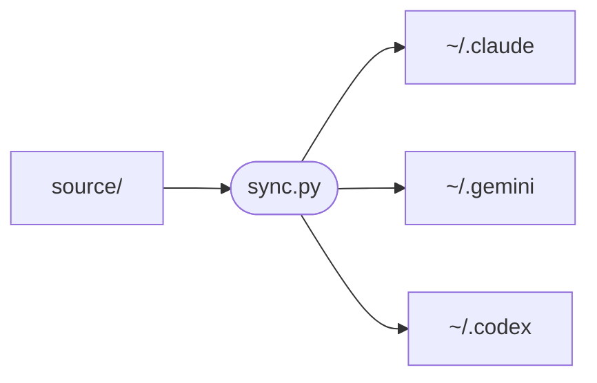
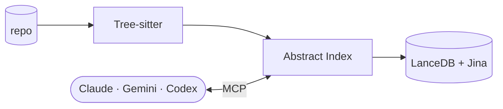
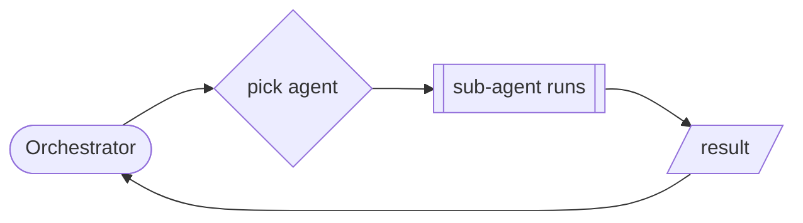
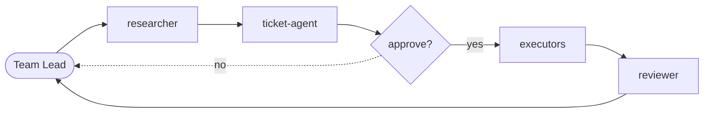

<div align="center">

# Kore Framework

**One source of truth for every AI coding assistant on your machine.**

Sync prompts, agents, skills, and semantic MCP wiring across Claude Code, Gemini CLI, and Codex — from a single repo.

<p>
  <a href="https://github.com/Go-Pr0/Kore-Framework/blob/main/LICENSE"></a>
  <a href="https://github.com/Go-Pr0/Kore-Framework/stargazers"></a>
  <a href="https://github.com/Go-Pr0/Kore-Framework/network/members"></a>
  <a href="https://github.com/Go-Pr0/Kore-Framework/issues"></a>
  <a href="https://github.com/Go-Pr0/Kore-Framework/commits/main"></a>
  
  
</p>

<p>
  
  
  
  
  
  
</p>

</div>

---

## What This Repo Does



`source/` holds the authoritative prompts, agent definitions, rules, skills, and MCP wiring. `sync.py` deploys them to each assistant's config directory.

**Edit source files here. Never touch the generated targets directly** — the next sync will overwrite them.

---

## Repository Layout

```
claude-oracle/
├── install.sh                  # Interactive installer (start here)
├── uninstall.sh                # Clean uninstaller
├── source/
│   ├── claude/
│   │   ├── CLAUDE.md           # Global system prompt (injected into every session)
│   │   ├── agents/             # Sub-agent & teammate definitions
│   │   ├── rules/              # Behavioral rules (global.md, etc.)
│   │   ├── skills/             # Callable /slash-command skills
│   │   └── removed/            # Tombstones — entries here are deleted from targets on sync
│   └── runtime/
│       ├── semantic-mcp.json   # MCP server config (model, port, device)
│       └── rtk-rewrite.sh      # Vendored RTK bash hook (deployed to ~/.claude/hooks/)
├── server/                     # abstract-fs MCP server (Python)
│   ├── install.sh              # Build server/.venv (called by install.sh)
│   └── src/
│       ├── abstract_engine/    # Tree-sitter indexer + LanceDB embeddings
│       └── abstract_fs_server/ # FastMCP server + tool registration
├── scripts/
│   ├── install.py              # Programmatic installer (sync + verify + daemon)
│   ├── sync.py                 # Deploy source → targets + backup
│   ├── verify.py               # Checksum all targets against source
│   ├── init_models.py          # Download HF models into cache
│   └── watch_sync.py           # File-watcher for auto-sync daemon
└── backups/                    # Timestamped snapshots before each sync
```

---

## Setup

### Quick start

```bash
bash install.sh
```

That's it. The interactive installer walks you through every step:

| Step | What it does |
|------|--------------|
| 1 | Checks prerequisites (Python 3.12+, git, jq) |
| 2 | Configures `.env` — prompts for your Hugging Face token and model cache path |
| 3 | GPU/device selection — probes for NVIDIA/AMD, lets you set `semantic_device` |
| 4 | Builds `server/.venv` with all Python deps (Tree-sitter, LanceDB, torch, etc.) |
| 5 | Downloads the two Jina models into your local cache |
| 6 | Enables offline mode in `.env` so the server never hits the network at startup |
| 7 | Installs RTK (token compression tool) via cargo or curl |
| 8 | Runs `sync.py` — deploys agents, skills, rules, hooks, and MCP config |
| 9 | Installs the auto-sync daemon (systemd on Linux, launchd on macOS) |
| 10 | Runs `verify.py` — checksums every deployed file and MCP wiring entry |

After install, any change you make under `source/` is automatically synced within seconds.

Pass `--yes` to accept all defaults non-interactively:

```bash
bash install.sh --yes
```

### Verify the deployment

```bash
python3 scripts/verify.py
```

Prints a line per check (`OK` / `FAIL`). Exits non-zero if anything is out of sync.

### Uninstall

```bash
bash uninstall.sh
```

Shows a full removal plan before doing anything, then cleanly removes everything Kore deployed:

- Stops and removes the systemd services (or macOS LaunchAgent)
- Removes oracle-placed agent, skill, and rule files from `~/.claude/`
- Strips the managed block from `~/.claude/CLAUDE.md`, `~/.gemini/GEMINI.md`, `~/.codex/AGENTS.md` — preserving any surrounding user content
- Removes the `abstract-fs` MCP entry from `~/.claude.json` and `~/.gemini/settings.json`
- Removes the RTK hook entry from `~/.claude/settings.json`

Does **not** remove this repo, model downloads, the semantic index cache, the RTK binary, or any file it did not place.

---

## The abstract-fs MCP Server

A semantic code search daemon that gives Claude structural visibility into any codebase without reading raw files. It runs at `http://127.0.0.1:8800/mcp` and is wired into Claude, Gemini, and Codex via their respective config files.

### How it works



A file watcher monitors the indexed repo and incrementally re-parses changed files, so the index stays fresh without manual re-indexing.

The server indexes a repo on first access (fast if previously cached) and stays live — file changes are picked up automatically via the embedded watchdog watcher.

### MCP Tools

| Tool | What it does |
|------|-------------|
| `search_codebase` | Primary search. Three modes: `semantic` (natural language intent), `keyword` (name/signature regex), `raw` (literal string in source). |
| `file_find` | Glob a path pattern and get abstract metadata (function count, line count, description) — cheaper than reading files. |
| `find_code` | Search function names, signatures, and one-liners across the abstract index — no grep needed. |
| `type_shape` | Inspect a type/class: fields, methods, base classes, call sites. |
| `semantic_status` | Check index health and coverage for a repo. |

**Every tool requires a `repo_path` argument** — the absolute path to the repo root being searched. The server is a shared daemon; `repo_path` is how it routes between projects.

### Search mode guide

```
semantic  →  "function that validates JWT tokens"
             "code that handles database connection retries"

keyword   →  "parse_order", "async.*handler", "TokenValidator"

raw       →  literal strings: log messages, config keys, TODO comments
```

---

## Agent Systems

Two systems exist. Which one to use depends entirely on whether `/team-lead` was invoked.

### Sub-agents (default)

When you haven't invoked `/team-lead`, you are the orchestrator. Spawn sub-agents via `Agent(subagent_type=...)` based on what the task needs.



**Available sub-agents and when to use them:**

| Sub-agent | Use when |
|-----------|----------|
| `researcher-agent` | Unknown external APIs, unfamiliar libraries, design tradeoffs |
| `bug-identifier-agent` | Diagnose a bug before touching code |
| `ticket-agent` | Multi-file or complex changes — produces a structured execution plan |
| `worker-agent` | Execute a well-defined change (directly, or from a ticket) |
| `reviewer-agent` | Verify correctness after non-trivial implementation |

Typical sequences:

```
Bug fix:        bug-identifier-agent → worker-agent
Complex change: ticket-agent → worker-agent(s) → reviewer-agent
Simple change:  worker-agent directly
Unknown API:    researcher-agent → ticket-agent → worker-agent
```

### Team pipeline (`/team-lead`)

Invoked with `/team-lead`. You become the team lead. Teammates self-route through a shared workspace — you only re-enter at gates.



All artifacts are written to `.team_workspace/{YYYYMMDD-HHMM-slug}/` inside the project root. No agent writes files outside that workspace except for production code changes.

**Modes:**
- `/team-lead` — Interactive: presents `ticket.json` to you for approval before executors run
- `/team-lead auto` — Fully automated: runs start to finish without interruption

---

## Model Routing

Always set `model` explicitly when spawning sub-agents.

| Model | When to use |
|-------|-------------|
| `opus` | Deep reasoning: algorithms, security-sensitive code, complex bugs spanning multiple systems, architectural decisions |
| `sonnet` | Default for everything else: planning, multi-file implementation, reviews, research |
| `haiku` | Zero-judgment mechanical tasks only: rename a constant, update a config key, pure search-and-replace |

If there's any ambiguity at all, use `sonnet`.

---

## Policy

- **Claude is the oracle.** Edit source files here; never edit generated targets.
- **Gemini and Codex are outputs.** Their configs are generated from Claude source — they don't define anything.
- **Native team workflows are Claude-only.** The `/team-lead` pipeline and team workspace convention are not replicated to other tools.
- **Backups before every sync.** `backups/<timestamp>/` preserves the previous state of all targets before each deployment.
