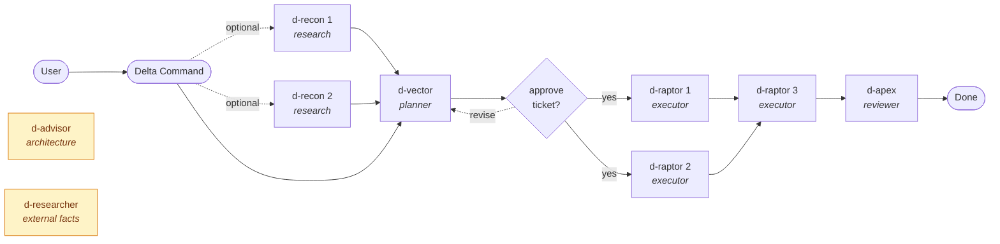
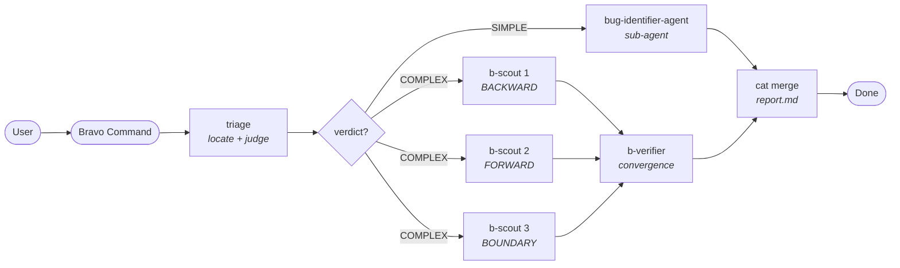
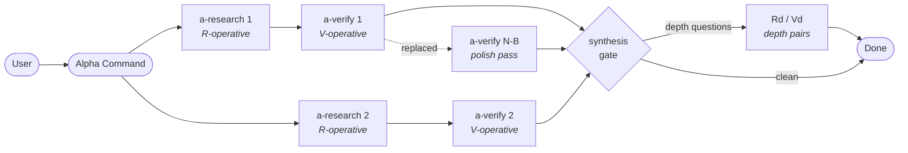

<div align="center">

# Kore Framework

**One source of truth for every AI coding assistant on your machine.**

Sync prompts, agents, skills, and semantic MCP wiring across Claude Code, Gemini CLI, and Codex — from a single repo.

<p>
  <a href="https://github.com/Go-Pr0/Kore-Framework/blob/main/LICENSE"></a>
  <a href="https://github.com/Go-Pr0/Kore-Framework/stargazers"></a>
  <a href="https://github.com/Go-Pr0/Kore-Framework/network/members"></a>
  <a href="https://github.com/Go-Pr0/Kore-Framework/issues"></a>
  <a href="https://github.com/Go-Pr0/Kore-Framework/commits/main"></a>
  
  
</p>

<p>
  
  
  
  
  
  
</p>

</div>

---

## What This Repo Does


`source/` holds the authoritative prompts, agent definitions, rules, skills, and MCP wiring. `sync.py` deploys them to each assistant's config directory.

**Edit source files here. Never touch the generated targets directly** — the next sync will overwrite them.

---

## Repository Layout

```
claude-oracle/
├── install.sh                  # Interactive installer (start here)
├── uninstall.sh                # Clean uninstaller
├── source/
│   ├── claude/
│   │   ├── CLAUDE.md           # Global system prompt (injected into every session)
│   │   ├── agents/             # Sub-agent & teammate definitions
│   │   ├── rules/              # Behavioral rules (agents.md, code.md, teams.md, …)
│   │   ├── skills/             # Callable /slash-command skills (delta-team, bravo-team, alpha-team, …)
│   │   └── removed/            # Tombstones — entries here are deleted from targets on sync
│   └── runtime/
│       ├── semantic-mcp.json   # MCP server config (model, port, device)
│       └── rtk-rewrite.sh      # Vendored RTK bash hook (deployed to ~/.claude/hooks/)
├── server/                     # abstract-fs MCP server (Python)
│   ├── install.sh              # Build server/.venv (called by install.sh)
│   └── src/
│       ├── abstract_engine/    # Tree-sitter indexer + LanceDB embeddings
│       └── abstract_fs_server/ # FastMCP server + tool registration
├── scripts/
│   ├── install.py              # Programmatic installer (sync + verify + daemon)
│   ├── sync.py                 # Deploy source → targets + backup
│   ├── verify.py               # Checksum all targets against source
│   ├── init_models.py          # Download HF models into cache
│   └── watch_sync.py           # File-watcher for auto-sync daemon
└── backups/                    # Timestamped snapshots before each sync
```

---

## Setup

### Quick start

```bash
bash install.sh
```

That's it. The interactive installer walks you through every step:

| Step | What it does |
|------|--------------|
| 1 | Checks prerequisites (Python 3.12+, git, jq) |
| 2 | Configures `.env` — prompts for your Hugging Face token and model cache path |
| 3 | GPU/device selection — probes for NVIDIA/AMD, lets you set `semantic_device` |
| 4 | Builds `server/.venv` with all Python deps (Tree-sitter, LanceDB, torch, etc.) |
| 5 | Downloads the two Jina models into your local cache |
| 6 | Enables offline mode in `.env` so the server never hits the network at startup |
| 7 | Installs RTK (token compression tool) via cargo or curl |
| 8 | Runs `sync.py` — deploys agents, skills, rules, hooks, and MCP config |
| 9 | Installs the auto-sync daemon (systemd on Linux, launchd on macOS) |
| 10 | Runs `verify.py` — checksums every deployed file and MCP wiring entry |

After install, any change you make under `source/` is automatically synced within seconds.

Pass `--yes` to accept all defaults non-interactively:

```bash
bash install.sh --yes
```

### Verify the deployment

```bash
python3 scripts/verify.py
```

Prints a line per check (`OK` / `FAIL`). Exits non-zero if anything is out of sync.

### Uninstall

```bash
bash uninstall.sh
```

Shows a full removal plan before doing anything, then cleanly removes everything Kore deployed:

- Stops and removes the systemd services (or macOS LaunchAgent)
- Removes oracle-placed agent, skill, and rule files from `~/.claude/`
- Strips the managed block from `~/.claude/CLAUDE.md`, `~/.gemini/GEMINI.md`, `~/.codex/AGENTS.md` — preserving any surrounding user content
- Removes the `abstract-fs` MCP entry from `~/.claude.json` and `~/.gemini/settings.json`
- Removes the RTK hook entry from `~/.claude/settings.json`

Does **not** remove this repo, model downloads, the semantic index cache, the RTK binary, or any file it did not place.

---

## The abstract-fs MCP Server

A semantic code search daemon that gives Claude structural visibility into any codebase without reading raw files. It runs at `http://127.0.0.1:8800/mcp` and is wired into Claude, Gemini, and Codex via their respective config files.

### How it works


A file watcher monitors the indexed repo and incrementally re-parses changed files, so the index stays fresh without manual re-indexing.

The server indexes a repo on first access (fast if previously cached) and stays live — file changes are picked up automatically via the embedded watchdog watcher.

### MCP Tools

| Tool | What it does |
|------|-------------|
| `search_codebase` | Primary search. Three modes: `semantic` (natural language intent), `keyword` (name/signature regex), `raw` (literal string in source). |
| `file_find` | Glob a path pattern and get abstract metadata (function count, line count, description) — cheaper than reading files. |
| `find_code` | Search function names, signatures, and one-liners across the abstract index — no grep needed. |
| `type_shape` | Inspect a type/class: fields, methods, base classes, call sites. |
| `semantic_status` | Check index health and coverage for a repo. |

**Every tool requires a `repo_path` argument** — the absolute path to the repo root being searched. The server is a shared daemon; `repo_path` is how it routes between projects.

### Search mode guide

```
semantic  →  "function that validates JWT tokens"
             "code that handles database connection retries"

keyword   →  "parse_order", "async.*handler", "TokenValidator"

raw       →  literal strings: log messages, config keys, TODO comments
```

---

## Agent Systems

Two systems exist side by side: lightweight **sub-agents** you drive yourself, and full **native teams** invoked via slash commands. Which one runs depends entirely on whether a `/…-team` skill was invoked.

### Sub-agents (default)

When no team skill is active, you are the orchestrator. Spawn sub-agents via `Agent(subagent_type=...)` based on what the task needs.


| Sub-agent | Use when |
|-----------|----------|
| `researcher-agent` | Unknown external APIs, unfamiliar libraries, design tradeoffs |
| `bug-identifier-agent` | Diagnose a bug before touching code |
| `ticket-agent` | Multi-file or complex changes — produces a structured execution plan |
| `worker-agent` | Execute a well-defined change (directly, or from a ticket) |
| `reviewer-agent` | Verify correctness after non-trivial implementation |

Typical sequences:

```
Bug fix:        bug-identifier-agent → worker-agent
Complex change: ticket-agent → worker-agent(s) → reviewer-agent
Simple change:  worker-agent directly
Unknown API:    researcher-agent → ticket-agent → worker-agent
```

---

### Native Teams

Three team skills are available. Each one turns Claude into a **team lead** that spawns dedicated teammates via `TeamCreate` and routes them through a shared workspace at `.team_workspace/{YYYYMMDD-HHMM-slug}/`.

| Skill | Purpose | Lead |
|-------|---------|------|
| `/delta-team` | Build / implement — plan, execute in waves, optional review | Delta Command |
| `/bravo-team` | Investigate — triage then trace a bug across layers | Bravo Command |
| `/alpha-team` | Research — parallel domain research with live verification | Alpha Command |

`/delta-team` supports an `auto` suffix (e.g. `/delta-team auto`) to skip the interactive approval gate. `/bravo-team` and `/alpha-team` always run straight through.

---

#### Delta Team — `/delta-team`

Implementation pipeline. **Delta Command** (you) writes `vision.md`, spawns **Vector** *(planner)* to produce a `ticket.json` with DAG-ordered waves, then spawns one **Raptor** *(executor)* per wave and fires roots in parallel. Two on-demand services stay idle alongside the raptors: **Advisor** *(architecture)* and **Researcher** *(external facts)* — raptors message them directly mid-wave. When every wave drains, **Apex** *(reviewer)* optionally runs a pass/fail review.

Two add-on skills expand the pipeline:
- `/delta-team-research` — inserts parallel **Recon** *(research)* agents before Vector.
- `/delta-team-review` — inserts **Apex** *(reviewer)* after all waves complete, with a targeted fix-pass loop on FAIL.



Advisor and Researcher sit **outside the DAG** — they never block a wave and never message Delta Command. Raptors ask them directly via `SendMessage` and get a direct reply.

| Agent | Role | Model | Notes |
|-------|------|-------|-------|
| `d-vector` *(planner)* | Writes `ticket.json` | sonnet | Revises on feedback during plan gate |
| `d-raptor-N` *(executor)* | Implements one wave | per `model_hint` | Messages Delta Command on completion |
| `d-apex` *(reviewer)* | Pass/fail review | sonnet | Dynamically picks quick vs full mode |
| `d-recon` *(researcher)* | Pre-ticket research | sonnet | Add-on via `/delta-team-research` |
| `d-advisor` *(architecture service)* | Design Q&A mid-wave | opus | On-demand, read-only |
| `d-researcher` *(external-facts service)* | Web Q&A mid-wave | sonnet | On-demand, web-only |

---

#### Bravo Team — `/bravo-team`

Bug-investigation pipeline. **Bravo Command** (you) always runs a cheap **triage** pass first — locate the manifestation point, read ~3 neighboring files, commit to a verdict:

- **SIMPLE** — single-layer bug → spawn `bug-identifier-agent` as a **sub-agent** (no team).
- **COMPLEX** — multi-layer bug → create a team with parallel **Scouts** *(tracers)* and one **Verifier** *(cross-checker)*.

Scouts never talk to each other; each one traces exactly one layer or direction (BACKWARD, FORWARD, or BOUNDARY) and writes a `trace.md`. The Verifier reads every trace, checks convergence and negative space, and writes `verification/report.md`. Bravo Command then runs a plain `cat` merge into `report.md` — no synthesis pass. Bravo **finds** bugs; it never fixes them.



| Agent | Role | Model | Notes |
|-------|------|-------|-------|
| `b-scout-{name}` *(tracer)* | Traces one layer/direction | haiku (sonnet for reflection-heavy code) | 2–4 per COMPLEX run |
| `b-verifier` *(cross-checker)* | Convergence + negative-space check | sonnet | Can trigger one targeted re-scout on divergence |
| `bug-identifier-agent` *(sub-agent)* | Single-layer root-cause | sonnet | Only on SIMPLE verdict — not a team member |

---

#### Alpha Team — `/alpha-team`

Live-research pipeline. **Alpha Command** (you) decomposes the topic into 2–5 non-overlapping domains. For each domain, it pre-spawns a paired **R-operative** *(research)* and **V-operative** *(verifier)* idle, then triggers every R in parallel. Each R writes a domain file, messages its paired V directly, and V overwrites the file with corrections. If V's changes were significant ("replaced"), Alpha Command spawns a **B-version** V for one final polishing pass — no C-version, two-pass ceiling.

After phase 1, a **synthesis gate** reads every domain file for coverage gaps and for depth questions revealed by the research itself. If any exist, phase 2 spawns fresh Rd/Vd pairs to chase them. The final deliverable is the set of verified `.md` files — Alpha never produces a single synthesized document.



| Agent | Role | Model | Notes |
|-------|------|-------|-------|
| `a-research-{N}` *(R-operative)* | Writes one domain file from live web search | haiku | Messages paired V directly |
| `a-verify-{N}` *(V-operative)* | Independently verifies and overwrites the file | haiku | Reports `polished` or `replaced` |
| `a-verify-{N}b` *(B-version V-operative)* | On-demand final polish | haiku | Only spawned if V reported `replaced` |
| `a-research-d{N}` / `a-verify-d{N}` *(depth pair)* | Phase 2 follow-up | haiku | Only spawned if synthesis gate finds depth questions |

---

### Team Workspace

Every native team run creates:

```
.team_workspace/{YYYYMMDD-HHMM-slug}/
├── vision.md              # pipeline contract — written by the lead
├── ticket.json            # delta: written by Vector
├── research_{topic}.md    # delta-research: written by each Recon
├── wave_{N}/handoff.json  # delta: written by each Raptor
├── review.md              # delta-review: written by Apex
├── scouts/scout_{name}/   # bravo: one trace.md per Scout
├── verification/report.md # bravo: written by Verifier
├── {domain}.md            # alpha: one per domain, overwritten by V
├── depth_{slug}.md        # alpha phase 2
├── advisor_log.md         # delta: d-advisor Q&A transcript
├── researcher_log.md      # delta: d-researcher Q&A transcript
└── handoff.json           # final handoff — written by the lead
```

No agent writes files outside the workspace except when editing actual production code.

---

## Model Routing

Always set `model` explicitly when spawning sub-agents.

| Model | When to use |
|-------|-------------|
| `opus` | Deep reasoning: algorithms, security-sensitive code, complex bugs spanning multiple systems, architectural decisions |
| `sonnet` | Default for everything else: planning, multi-file implementation, reviews, research |
| `haiku` | Zero-judgment mechanical tasks only: rename a constant, update a config key, pure search-and-replace |

If there's any ambiguity at all, use `sonnet`.

---

## Policy

- **Claude is the oracle.** Edit source files here; never edit generated targets.
- **Gemini and Codex are outputs.** Their configs are generated from Claude source — they don't define anything.
- **Native team workflows are Claude-only.** The `/delta-team`, `/bravo-team`, and `/alpha-team` pipelines and the team workspace convention are not replicated to other tools.
- **Backups before every sync.** `backups/<timestamp>/` preserves the previous state of all targets before each deployment.
