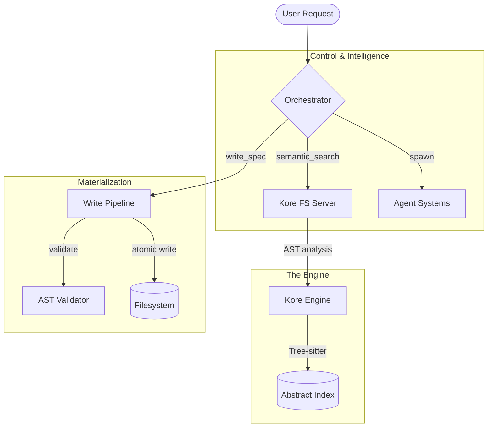
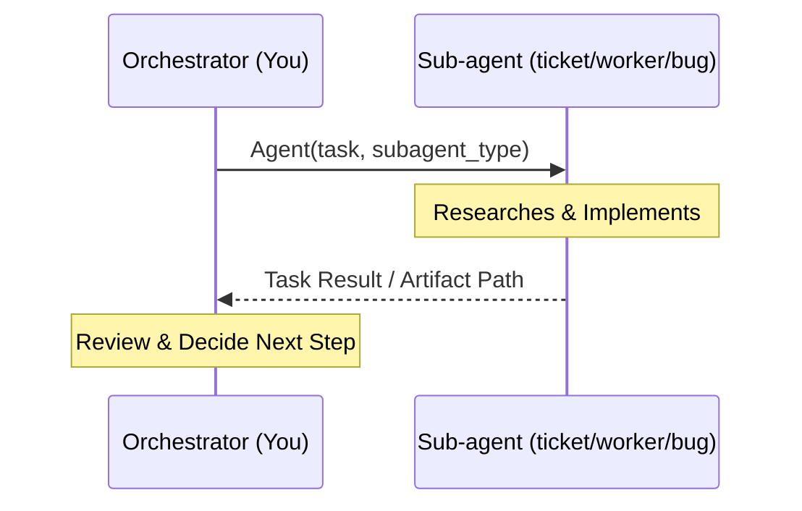
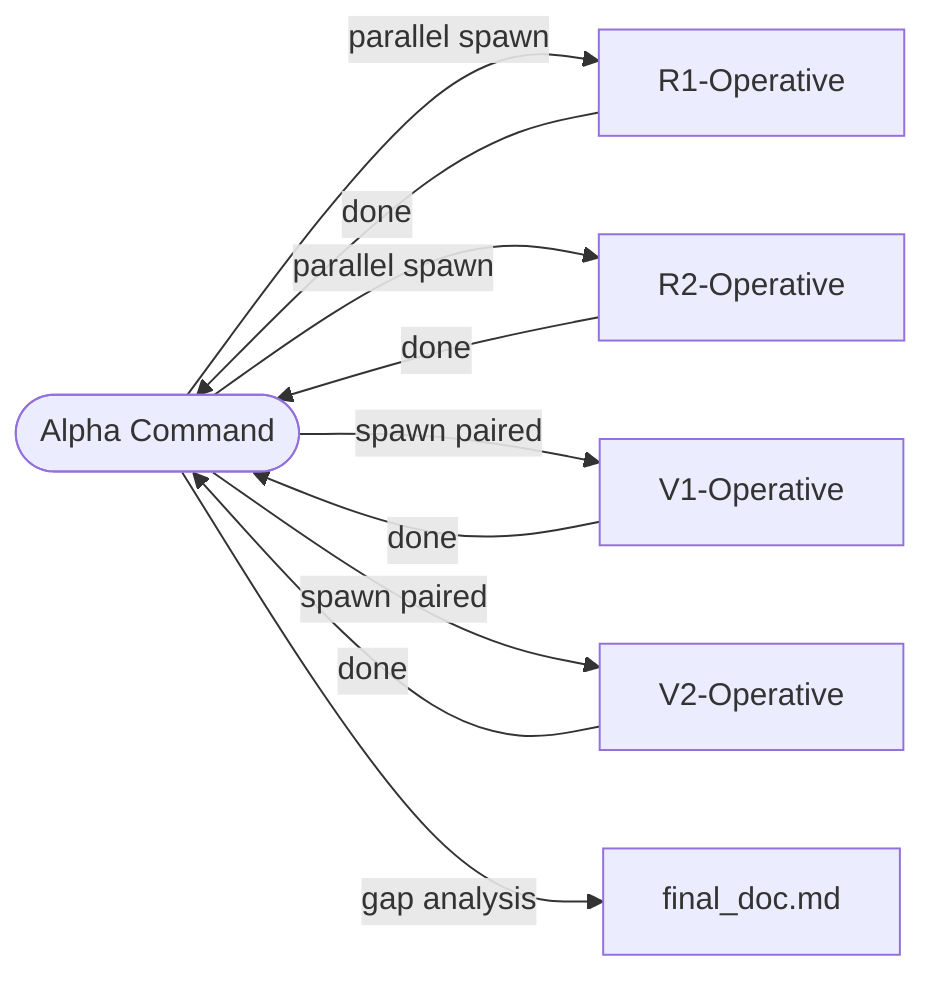
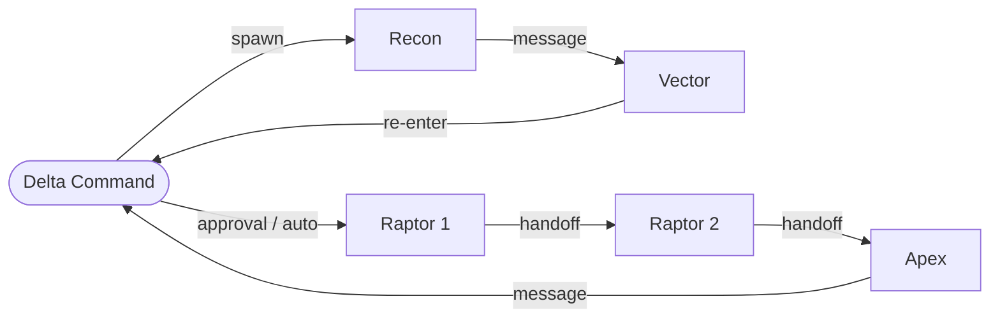

# The Kore Framework

A high-performance, multi-layered AI engineering system optimized for speed, reliability, and token efficiency.

## 🏗️ Core Architecture

Kore decouples architectural reasoning from implementation mechanics through four key layers:

1.  **Kore Engine**: Tree-sitter based indexing for deep semantic code analysis.
2.  **Kore FS Server (MCP)**: Exposes "Abstract Tools" for surgical codebase visibility.
3.  **Kore Control Panel**: Manages sessions, prompts, and tool orchestration.
4.  **Write Pipeline**: Ensures safe, validated code changes via AST verification.

---

## 🔍 Codebase Discovery (abstract-fs)

**Mandatory Rule:** Always use `abstract-fs` tools before reading raw files.

*   **Initialize**: Pass the absolute `repo_path` (project root) to every tool call.
*   **Search Hierarchy**: `semantic` (intent) → `keyword` (names/signatures) → `raw` (literal strings/logs).
*   **Precision**: Prefer natural language ("function that validates tokens") over single keywords.
*   **Efficiency**: Limit `max_results` (default 15) and iterate with narrower queries.
*   **Avoid**: Never use generic `Explore` or `codebase-analyst` sub-agents for discovery.

---

## 🤖 Agent Systems

Two distinct systems are available. Choosing between them depends on task complexity.

### 1. Sub-agents (Default / Non-Team)
Flexible, stateless agents spawned for specific tasks. They return results directly to you.

*   **When to use**: Diagnostics, simple fixes, or when you need manual control over the sequence.
*   **Types**: `bug-identifier-agent`, `researcher-agent`, `ticket-agent`, `worker-agent`, `reviewer-agent`.

### 2. Teammates (Team Mode)

Two team pipelines are available. Choose based on whether the goal is research or execution.

#### `/alpha-team` — Live Research Pipeline
You become **Alpha Command**. Decomposes a topic into domains, spawns paired R/V operatives with live web search, and produces a verified documentation artifact as of today's date.

*   **When to use**: Researching packages, APIs, frameworks, or any domain where training data may be stale. Feed output to `/delta-team` as reference material.
*   **Operatives**: R-operatives (research) and V-operatives (verify) scale to N pairs dynamically.
*   **Model routing**: Alpha Command = Sonnet. R/V operatives = Haiku.

#### `/delta-team` — Execution Pipeline
You become **Delta Command**. Plans and executes multi-phase code changes via Vector (planning) and Raptor (execution) agents.

*   **When to use**: Multi-phase, complex architectural changes requiring a rigorous pipeline.
*   **Workspace**: All artifacts live in `.team_workspace/{timestamp-slug}/`.
*   **Modes**: 
    *   **INTERACTIVE**: You present the plan to the user for approval.
    *   **AUTO**: Pipeline runs start-to-finish without interruption.

---

## 🚦 Model Routing

Always assign the appropriate model tier to ensure reasoning depth where needed:

| Tier | Model | Best For... |
| :--- | :--- | :--- |
| **Opus** | `opus` | Core logic, algorithms, architectural decisions, complex multi-domain bugs. |
| **Sonnet** | `sonnet` | **Default**. Planning, multi-file implementation, research, code review. |
| **Haiku** | `haiku` | Mechanical tasks (renaming, config updates) with **zero** judgment required. |

---

## 📂 Project Structure & Prompts

*   **Global Rules**: Found in `~/.claude-oracle/source/claude/rules/global.md`.
*   **Agent Definitions**: Located in `~/.claude-oracle/source/claude/agents/`.
*   **Global Skills**: Explicitly callable skills (e.g., `/delta-team`) are in `~/.claude-oracle/source/claude/skills/`.
*   **Local Overrides**: Use repo-local `CLAUDE.md` or `AGENTS.md` for project-specific constraints.
